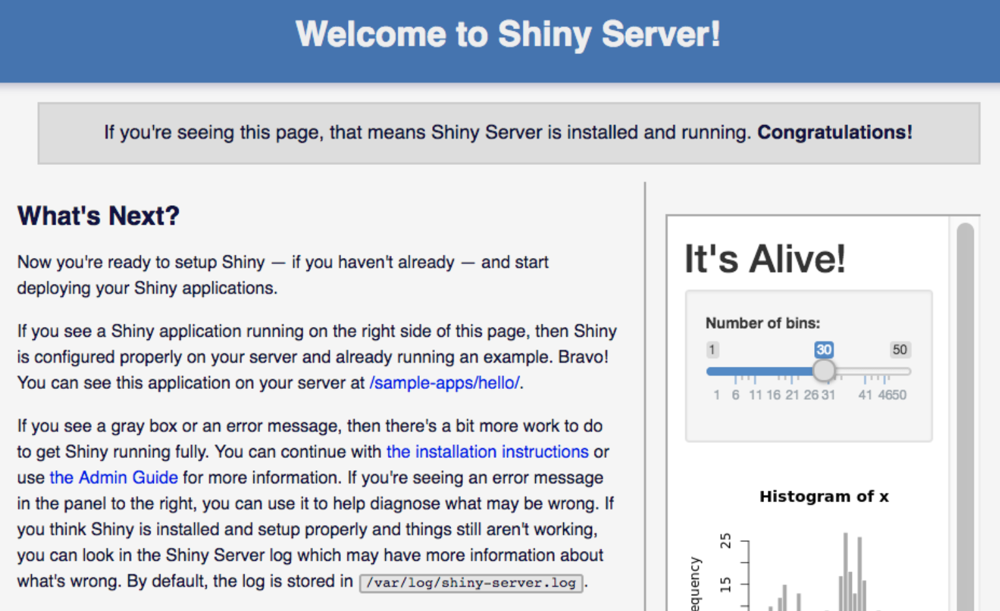
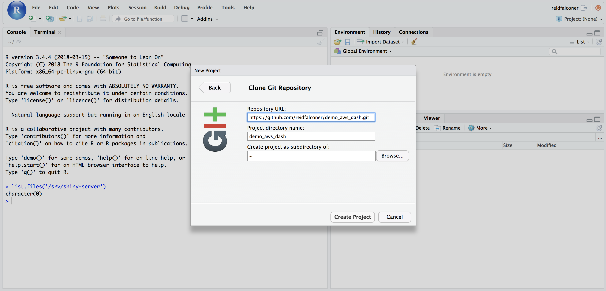

<!-- <div id="logo-container"> -->
<!--  -->
<!-- </div> -->

```{r setup, include=FALSE}
knitr::opts_chunk$set(echo = TRUE, fig.align = 'center', dev = 'svglite', fig.ext = '.svg')
#knitr::opts_knit$set(root.dir = "..")
library(tidyverse)
library(knitr)
library(kableExtra)
```
<style>
.list-group-item.active, .list-group-item.active:focus, .list-group-item.active:hover {
    background-color: #0083a8;
}
</style>

# Step 1: Setup an AWS Account

[Amazon](aws.amazon.com/) provides one year’s worth of access to their Free Tier for AWS. However, there are a vast number of options available, and they are worth checking out. The important one is that they provide a free 750 hours/month to deploy an EC2 instance. That’s just enough to keep 1 EC2 instance active 24/7.

If you aren’t familiar with EC2, think of it as your always-on personal Linux computer that you can connect to through SSH, and access through the web using an IP address. One step further and you can access it through a custom domain name.

# Step 2: Launch EC2 instance following this AWS [10-Minute Tutorial](https://aws.amazon.com/getting-started/launch-a-virtual-machine-B-0/launch-a-virtual-machine-B-1/).
```{r, echo=FALSE, out.width = '80%'}
knitr::include_graphics("images/aws.png")
```

### Configuration Settings

The configuration setting I used are as follows:
```{r, echo=FALSE, warning= FALSE, message=FALSE}
text_tbl <- data.frame(
  Option = c("AMI", "Instance Type","Configure Instance","Storage", "Tag", "Security Group"),
  Choice = c(
    "Ubuntu Server 14.04 LTS (HVM), SSD Volume Type - This option is chosen since it is free tier eligible and it behaves well when setting up an RStudio and Shiny server.",
    "t2.micro - The free tier option. However, given that R works in memory, this choice is very restrictive (only 1 GiB memory). Thus, I recommend choosing an instance with more memory (i.e. the ones that are memory optimised) if you are going to be doing large amounts of computing.", 
    "All Default - Skip this page if you want.", 
    "16gb - The default is 8gb but you can get up to 30 GB of EBS General Purpose (SSD) or Magnetic storage on the free tier.",
    "ShinyDashboard - Tags can be helpful for organizing your AWS services.",
    "Security Group: http-ssh-anywhere - This part of the configuration tells your instance who is allowed to talk to and access it. These are the rules you use so that you can connect remotely (ssh), and http ports to display web data. Using the configurations recommended by [mgritts](http://mgritts.github.io/2016/07/08/shiny-aws/), here are the 4 security rules:"
  )
)

kable(text_tbl) %>%
  kable_styling("striped", full_width = F) %>%
  column_spec(1, bold = T) %>% 
  row_spec(0, bold = T, color = "white", background = "#0083a8")
```


<!-- - AMI: Ubuntu Server 14.04 LTS (HVM), SSD Volume Type - This is chosen since it is free tier eligible and it behaves well when setting up a R Shiny Server. -->
<!-- - Instance Type: t2.micro - Free tier option. However, given that R works in memory, this choice is very restrictive (only 1 GiB memory). Thus, I recomend choosing an instance with more memory (i.e the ones that are memory optimized) if you are going to be doing large amounts of computing. -->
<!-- - Configure Instance: all default - Skip this page if you want. -->
<!-- -Storage: 16gb - Default is 8gb, but can get up to 30 GB of EBS General Purpose (SSD) or Magnetic storage on the Free tier. -->
<!-- - Tag: ShinyDashboard - Tags can be helpful for organizing you AWS services. -->
<!-- - Security Group: http-ssh-anywhere - This part of the configuration tells your instance who is allowed to talk to and access it. These are the rules I use so that I can connect remotely (ssh), and http ports to display web data. Using the configurations recommended by [mgritts](http://mgritts.github.io/2016/07/08/shiny-aws/), here are the 4 security rules:  -->
```{r, echo=FALSE, warning= FALSE, message=FALSE}
library(readr)
aws_table <- read_delim("aws_table.csv", delim = ";")
View(aws_table)

kable(aws_table) %>%
  kable_styling("striped", full_width = F) %>%
  column_spec(1, bold = T) %>% 
  row_spec(0, bold = T, color = "white", background = "#0083a8")
```

In the final step, you can "Review Instance Launch". This tread will allow you to review your instance launch details. Once you've done that, click "Launch" to assign your instance a key pair.

Upon clicking launch, you will be prompted with a pop-up to "Select an existing key pair or create a new key pair" I recommend always creating a new key pair and naming it appropriately (i.e. `aws_dashboard`). Be sure to save this (`.pem` file) in a secure and easily accessible location as you will not be able to download the file again.

Once downloaded and stored, you can "Launch" your instance by clicking `Launch Instances` After a few minutes of setup and initialisation your instance is ready to use, and you can view it by clicking `View Instances`. Be sure to make a note of the Public IP (`<public-ip>`); you’ll use this to connect to the instance.

# Step 3: Connecting to your new instance. 

Once your instance is up and running, you can go ahead and connect to it by clicking on it and clicking "Connect".

You should get the following pop-up:
```{r, echo=FALSE, out.width = '80%'}

```

Now it's time to fire up your command line - on a Mac, it's your Terminal (if you run on Windows, you’ll need to download [PuTTY](https://www.putty.org/).) - and change your directory (cd) to where your key (`.pem` file) was securly moved to (i.e out of your download folder).

```{r, eval= F}
# set working directory 
$ cd path_to_file/file.pem
```
Back in Terminal, you'll want to enter:
```{r, eval= F}
$ chmod 400 "file.pem"
```
This makes you public key not publicly viewable (i.e. hides the file) (only needs to be run the first time you use your SSH key).

Next, you’ll connect to your instance by typing (copy and paste it exactly as shown under "Example" in the pop-up):
```{r, eval= F}
$ ssh -i "file.pem" ubuntu@ec2-IPADDRESS.compute-1.amazonaws.com
```
When you connect for the first time, it might give you a prompt asking: "Are you sure you want to continue connecting?” Type yes. Hopefully, you’ll see something like this:

```{r, eval=FALSE}
Welcome to Ubuntu 14.04.5 LTS (GNU/Linux 3.13.0-149-generic x86_64)

 * Documentation:  https://help.ubuntu.com/

  System information as of DATE UTC 2018

  System load: 0.0               Memory usage: 5%   Processes:       81
  Usage of /:  10.2% of 7.74GB   Swap usage:   0%   Users logged in: 0

  Graph this data and manage this system at:
    https://landscape.canonical.com/

  Get cloud support with Ubuntu Advantage Cloud Guest:
    http://www.ubuntu.com/business/services/cloud

0 packages can be updated.
0 updates are security updates.
```

### Disconnecting from your instance

If you ever want to disconnect from your instance (when you've finished this tutorial), simply type `exit` into your terminal and you’ll be logged out and disconnected from your AWS instance.
```{r, eval= F}
# disconnect from instance
$ exit
```

# Step 2: Installing System Libraries.

You are now ready to install R and the required system libraries. But first, you need to update the Linux application library. 

```{r, eval=F}
# update application library
$ sudo apt-get update
$ sudo apt-get -y install \
    nginx \
    gdebi-core \
    apache2-utils \
    pandoc \
    pandoc-citeproc \
    libssl-dev \
    libcurl4-gnutls-dev \
    libcairo2-dev \
    libgdal-dev \
    libgeos-dev \
    libproj-dev \
    libxml2-dev \
    libxt-dev \
    libv8-dev \
    git
```
To confirm that things are working as they should be. Type your `http://<public-ip>`  into the URL bar of a browser you should get the following nginx welcome screen: 
```{r pressure, echo=FALSE, out.width = '80%'}

```
Nginx will be used to improve the performance, reliability, and security of your the shiny dashboard/application.

Move back in the terminal. The following commands set the sources to the RStudio mirror, then grabs keys to authenticate the installation.

```{r, eval=F}
$ sudo sh -c 'echo "deb http://cran.rstudio.com/bin/linux/ubuntu trusty/" >> /etc/apt/sources.list'
$ gpg --keyserver keyserver.ubuntu.com --recv-key E084DAB9
$ gpg -a --export E084DAB9 | sudo apt-key add -
$ sudo apt-get update
```

### R Server
You can then install R using the following command:
```{r, eval=F}
# install R
$ sudo apt-get install r-base
```
You may get a prompt saying "X MB of additional disk space will be used. Do you want to continue? [Y/n]" Type `Y`. 

We can then run R (within the Terminal) after the install and check the `sessionInfo()` using the following code:
```{r, eval=F}
$ R
> sessionInfo()
> quit()
```

You are now ready to install both the RStudio and R Shiny Servers using the syntax below. However, please check the [RStudio Server](https://www.rstudio.com/products/rstudio/download-server/) and [Shiny Server](https://www.rstudio.com/products/shiny/download-server/) links to make sure that the commands are for the most recent versions of the respective servers.

###  RStudio Server
```{r, eval=F}
# Install RStudio Server
$ sudo apt-get install gdebi-core
$ wget https://download2.rstudio.org/rstudio-server-1.1.453-amd64.deb
$ sudo gdebi rstudio-server-1.1.453-amd64.deb
```

###  Shiny Server
- NB: One must install the Shiny R package before installing the Shiny Server:
```{r, eval=F}
$ sudo su - \
-c "R -e \"install.packages('shiny', repos='https://cran.rstudio.com/')\""
```
```{r, eval=F}
# Install Shiny Server
$ sudo apt-get install gdebi-core
$ wget https://download3.rstudio.org/ubuntu-14.04/x86_64/shiny-server-1.5.7.907-amd64.deb
$ sudo gdebi shiny-server-1.5.7.907-amd64.deb
```
Type `y` for both "Do you want to install the software package?" questions.

You can now check that both the servers were installed successfully using the `ls` bash command: 
```{r, eval=F}
$ ls  # bash command ls = lists your files
```
This input should return `rstudio-server-X-amd64.deb  shiny-server-X-amd64.deb`: The two .deb files, one for rstudio-server and one for shiny-server (and their respective versions). 

- See this handy [Bash CheatSheet for UNIX Systems](https://gist.github.com/LeCoupa/122b12050f5fb267e75f) for other bash commands.

# Step 3: Install R Libraries: 

You can now install all your required R packages onto the server. However, installing R packages is a little different on the server than on your local machine. For packages to be available for all users and roles, you must use `$ sudo su - -c "R ..."` when installing the packages.

The commands below install shiny related libraries, the tidyverse and htmlwidget libraries (you should add all the packages and their dependencies that your dashboard/application requires to render successfully). 

_Warning: if you are using an instance with little memory some packages may exhaust the memory and thus won’t be able to compile. (One negative of the Free Tier EC2 instance)_

### Shiny related libraries
```{r, eval=F}
$ sudo su - -c "R -e \"install.packages(c('shiny', 'rmarkdown', 'shinydashboard', 'shinyjs', 'flexdashboard'), repos='http://cran.rstudio.com/')\""
```

### Tidyverse
```{r, eval=F}
$ sudo su - -c "R -e \"install.packages('tidyverse', repos='http://cran.rstudio.com/')\""
```

<!-- ### Spatial Analysis -->
<!-- ```{r, eval=F} -->
<!-- $ sudo su - -c "R -e \"install.packages(c('sp', 'rgdal', 'rgeos', 'adehabitatHR', 'geojsonio', 'maptools'), repos='http://cran.rstudio.com/')\"" -->
<!-- ``` -->

### htmlwidgets
```{r, eval=F}
$ sudo su - -c "R -e \"install.packages(c('leaflet', 'highcharter', 'DT'), repos='http://cran.rstudio.com/')\""
```

### devtools
If you want to install the development version of a package (ggplot2 in this example) from GitHub, you can use:
```{r, eval=F}
sudo su - -c "R -e \"install.packages('devtools', repos='http://cran.rstudio.com/')\""
sudo su - -c "R -e \"devtools::install_github('tidyverse/ggplot2')\""
```

### Package Error
If you get an error installing one of your packages. The problem is most likely a memory issue (especially if you are using the 1 GiB free tier option). One way around this is to look online for an Ubuntu repository of the precompiled R package. 

For example: I got an error trying to install the `readr` package (in the tidyverse). Therefore, I used the code below to access the Launchpad PPA. (Packages for the CRAN repository are built on a Launchpad PPA called RutteR). See [RutteR](https://launchpad.net/~marutter/+archive/ubuntu/rrutter) for more info.

```{r, eval=F}
$ sudo add-apt-repository -y "ppa:marutter/rrutter"
$ sudo add-apt-repository -y "ppa:marutter/c2d4u"
$ sudo apt update
$ sudo apt install r-cran-readr
```

To check how much memory you have used you can use the following shell command: 
```{r, eval=F}
# check instance memory
$ free -m
```
Where `-m` shows output in megabytes and `-g` shows output in gigabytes.

Furthermore, you can now easily confirm that both your RStudio and R Shiny servers are running correctly: 

- The R Shiny Server is served on port `3838`. Thus, if you type your `http://<public-ip>:3838`  into the URL bar of a browser you should see a default index.html page with a shiny app and rmarkdown document.

```{r, echo=FALSE, out.width = '80%'}

```

- The RStudio Server is served on port `8787`. Therefore, typing `http://<public-ip>:8787` into the URL bar, you should get the following RStudio sign in page:

```{r, echo=FALSE, out.width = '80%'}

```

# Step 4: Password Protecting your Shiny Server

The open source version of Shiny Server doesn’t have password protection as a feature (Shiny Server Pro does). However, it is sometimes both essential and convenient to password protect your application/dashboard. Thus, you are now going to use nginx to password protect your shiny server. 

First, you must stop both the nginx service and shiny-server. This process should always be done before changing any server configuration settings.

- Back in terminal:
```{r, eval=F}
# stop nginx service and shiny-server
$ sudo service nginx stop
$ sudo stop shiny-server
```

In order for the password protection to take effect, you must change the server configuration files directly.

###  nginx config changes: 
First, you are going to change the nginx config file located at `/etc/nginx/sites-available/default`. You'll use `nano` to open and modify the config files. 

```{r, eval=F}
$ sudo nano /etc/nginx/sites-available/default
```
You should see something like this:
```{r, echo=FALSE, out.width = '90%'}

```

```{r, eval=FALSE, include=FALSE}
 GNU nano 2.2.6                   File: /etc/nginx/sites-available/default                                             
# You may add here your
# server {
#       ...
# }
# statements for each of your virtual hosts to this file

##
# You should look at the following URL's in order to grasp a solid understanding
# of Nginx configuration files in order to fully unleash the power of Nginx.
# http://wiki.nginx.org/Pitfalls
# http://wiki.nginx.org/QuickStart
# http://wiki.nginx.org/Configuration
#
# Generally, you will want to move this file somewhere, and start with a clean
# file but keep this around for reference. Or just disable in sites-enabled.
#
# Please see /usr/share/doc/nginx-doc/examples/ for more detailed examples.
##

server {
        listen 80 default_server;
        listen [::]:80 default_server ipv6only=on;

        root /usr/share/nginx/html;
        index index.html index.htm;

        # Make site accessible from http://localhost/
        server_name localhost;
                                                   [ Read 112 lines ]
^G Get Help         ^O WriteOut         ^R Read File        ^Y Prev Page        ^K Cut Text         ^C Cur Pos
^X Exit             ^J Justify          ^W Where Is         ^V Next Page        ^U UnCut Text       ^T To Spell
```

Now delete __EVERY SINGLE LINE__ (Using `Ctrl+k`) and replace it with:
```{r, eval=F}
server {
    listen 80;

    location / {
    proxy_pass http://127.0.0.1:3838/;
    proxy_redirect http://127.0.0.1:3838/ $scheme://$host/;
    proxy_http_version 1.1;
    proxy_set_header Upgrade $http_upgrade;
    proxy_set_header Connection "upgrade";
    auth_basic "Username and Password are required";
    auth_basic_user_file /etc/nginx/.htpasswd;
 }
}
```

Resulting in:

```{r, echo=FALSE, out.width = '90%'}

```

To exit-out on of nano, use `Ctrl+x` and type `Y` to save. You can then press enter to return to the terminal. (See [Useful Nano Keyboard Commands](https://staffwww.fullcoll.edu/sedwards/Nano/UsefulNanoKeyCommands.html))

### R Shiny config changes: 
You  must now do a similar process to the shiny-server config file at `/etc/shiny-server/shiny-server.conf`

```{r, eval=F}
$ sudo nano /etc/shiny-server/shiny-server.conf
```

Where it currently reads listen 3838, add `127.0.0.1`: 
```{r, eval=F}
# Instruct Shiny Server to run applications as the user "shiny"
run_as shiny;

# Define a server that listens on port 3838
server {
  listen 3838 127.0.0.1; 

  # Define a location at the base URL
  location / {

    # Host the directory of Shiny Apps stored in this directory
    site_dir /srv/shiny-server;

    # Log all Shiny output to files in this directory
    log_dir /var/log/shiny-server;

    # When a user visits the base URL rather than a particular application,
    # an index of the applications available in this directory will be shown.
    directory_index on;
  }
}
```
```{r, echo=FALSE, out.width = '90%'}

```
Use `Ctrl+x` to exit and type `Y` to save. Press enter to return to the command line.

`nano` does take some time getting used to but now you have set up the groundwork required to create users and passwords on your Shiny Server. The IP address `127.0.0.1` is a special-purpose IPv4 address called localhost or loopback address. All computers use this address as their own, but it doesn't let them communicate with other devices like a real IP address does. See [www.lifewire.com](https://www.lifewire.com/network-computer-special-ip-address-818385) for more information. 

# Step 5: Create Users and Passwords

In Step 2 you installed the `apache2-utils` package which will allow you to create a password file using the Apache utilities. While OpenSSL can encrypt passwords for Nginx authentication, many users find it easier to use a purpose-built utility. The `htpasswd` utility serves this function well.

You can now create users and passwords with `htpasswd`. You’ll first create a user, then, be prompted to enter and confirm a password. You will then restart the nginx service and shiny-server once the required users are added.

- Note: the first time we use this utility, you need to add the `-c` option (switch) to create the specified password file (`.htpasswd` in this example).  You can then specify a username (exampleuser in this example) at the end of the command to create a new entry into that file:

```{r, eval= F}
$ cd /etc/nginx
$ sudo htpasswd -c /etc/nginx/.htpasswd exampleuser
```
- You will be asked to supply and confirm a password for the user.

- If you want to add additional users, it is essential that you leave out the `-c` argument. As here you want to add to the `.htpasswd` password file and not recreate the password file. If a password file already exists, it is rewritten and truncated when a new one is created.

For example:
```{r, eval= F}
# add shiny-server user
$ sudo htpasswd /etc/nginx/.htpasswd additionaluser
```

Now if you view the contents of your `.htpasswd` file, you should see the username and the encrypted password for the added users.
```{r, eval= F}
# list shiny-server users
$ cat /etc/nginx/.htpasswd
```

Furthermore, if you want to remove the additionaluser (any user) from the Shiny Server, use the `-D` switch like so:
```{r, eval=F}
# remove shiny-server user
$ sudo htpasswd -D /etc/nginx/.htpasswd additionaluser
```

Additionally, to change the password of a user, one can merely just overite the existing user with the same username. Because if the username does not exist in the `.htpasswd` file, an entry is added. However, if it does exist, the password is changed (overwritten). For example, if we want to change the password of user `exampleuser` then we can simply run the following command:

(NB: remember to leave out the `-c` switch)

```{r, eval= F}
# change password of shiny-server user
$ sudo htpasswd /etc/nginx/.htpasswd exampleuser
```

Once all the required users are added, you can restart the nginx service and shiny-server.
```{r, eval= F}
# start shiny-server and nginx service
$ sudo start shiny-server
$ sudo service nginx start
```

You can now check whether R Shiny servers is in fact password protected. Just type your `public-ip` into the URL bar of your browser (`http://<public-ip>`) and you should get a security pop-up requesting the username and password of an added user. 

NB: Do not use ``http://<public-ip>:3838` (as done previously) just go directly to `http://<public-ip>`

# Step 6: Create an R Studio Password and Gain Access to the R Studio Server

You can add an R Studio user with:
```{r, eval = F}
# add RStudio user 
$ sudo adduser exampleuser 
```

This will prompt you to `Enter new UNIX password:`. This is where you define your R Studio Password. Furthermore, you will be asked to provide user information for user `exampleuser`. However, you can just press ENTER for the default. And press [Y] to confirm that the information correct.

Once this is done, you can now access your RStudio GUI using your user information. Go to `http://<public-ip>:8787` and log in. You should be then be greeted by the friendly RStudio GUI. 
```{r, echo=FALSE, out.width = '80%'}

```

### Additional RStudio Server Information
Adding a user can be done multiple times. However, each user will gain access to separate (individual) RStudio GUI's. 

- Additionally, if you want to check current users on R Studio Server, you can use:
```{r, eval=F}
# list RStudio users
$ cut -d: -f1 /etc/passwd
```
If you want to change the password of an R Studio user, you can do so with:
```{r, eval=F}
# change password of RStudio user 
$ sudo passwd exampleuser # where exampleuser is the username of the user of interest 
```
This will prompt you to enter the new UNIX password for user "exampleuser". 

Furthermore, if you want to remove a user, you can use:
```{r, eval=F}
# remove RStudio user 
$ sudo userdel exampleuser 
```
However, if you get the note "userdel: user exampleuser is currently used by process 8334 (<pid>)", then you have first to kill the process using: 
```{r, eval=F}
# kill RStudio user session
$ sudo rstudio-server kill-session <pid>
```
And then you will be able to remove the user exampleuser using `$ sudo userdel`

Please see the [RStudio Server Professional Edition Administration Guide](http://docs.rstudio.com/ide/server-pro/index.html) and the [Shiny Server Professional Administrator's Guide](http://docs.rstudio.com/shiny-server/) for more detailed information and alternative commands.  

# Step 7: Deploying your Shiny Flexdashboard/Shiny App to AWS

Before you deploy your desired dashboard (from GitHub), you will want to remove the default `index.html` and `sample-apps` from the R Shiny server. Annoyingly, this must be down via the command line using the following code:
```{r, eval = F}
# remove default files on shiny server
$ sudo chmod 7777 /srv/shiny-server/  #set file permissions to read/write
$ sudo rm /srv/shiny-server/index.html
$ sudo rm -rf /srv/shiny-server/sample-apps
```

Once this is done, all further work can be executed in the R Studio UI `http://<public-ip>:8787`.

The first thing you should do is to configure your git `user.name` and `user.email` within the R Studio terminal. By entering the following:
```{r, eval = F}
git config --global user.name 'Your Name'
git config --global user.email 'your@email.com'
git config --global credential.helper 'cache --timeout=10000000'
```

You can then clone a GitHub repository within the R Studio interface, using the "Clone with HTTPS" URL (see Jenny Bryan's [happygitwithr.com](happygitwithr.com/)) available on GitHub. 

For example: https://github.com/reidfalconer/demo_aws_dash.git

```{r, echo=FALSE, out.width = '80%'}

```

Finally, all you have to do is to move the required files (flexdashboard.Rmd and its dependencies) over the `srv/shiny-server` using `file.copy()` (all done within the R Studio Console).

```{r, eval = F}
list.files('/srv/shiny-server') # shows you what is currently in shiny directory - should return `character(0)`
file.copy(paste0(getwd(),"/flexdashboard.Rmd"),"/srv/shiny-server/")
```

For Example:
```{r, eval = F}
list.files('/srv/shiny-server')
file.copy(paste0(getwd(),"/AWS_demo.Rmd"),"/srv/shiny-server/")
```
```{r, echo=FALSE, out.width = '80%'}

```

- You can use `file.remove('/srv/shiny-server/flexdashboard.Rmd')` to remove the `flexdashboard.Rmd`. And add a new dashboard to the Shiny Server.

# Step 8: Success

Go to  `http://<public-ip>` 

If everything worked then you should see: 
```{r, echo=FALSE, out.width = '80%'}

```

# Maintainence 

#### Upgrading your RStudio and Shiny Servers

To upgrade to a new version you simply need to just install the new version. If you perform an upgrade and an existing version of the server is currently running, then the upgrade process will ensure that active sessions are immediately migrated to the new version. 

```{r, eval = F}
# update Rstudio and Shiny servers
$ sudo gdebi <rstudio-server-version.deb>
$ sudo gdebi <shiny-server-version.deb>
```

# Resources
- Catherine Ordun's: [Deploying an R Shiny App to AWS](http://tm3.ghost.io/2017/12/31/deploying-an-r-shiny-app-to-aws/) 
- Mitchell Gritt's: [Shiny Server on AWS](http://mgritts.github.io/2016/07/08/shiny-aws/)
- Davis Vaughan's: [RStudio and Shiny Servers with AWS](https://blog.davisvaughan.com/post/rstudio-shiny-aws-1/)
- Special thanks to Hendrik van Broekhuizen for all the tips and tricks. 